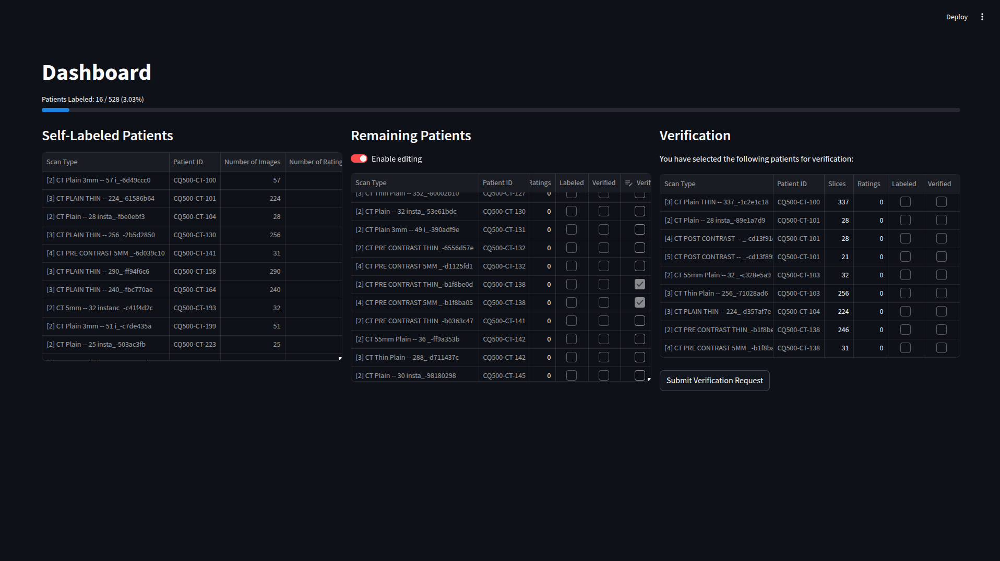
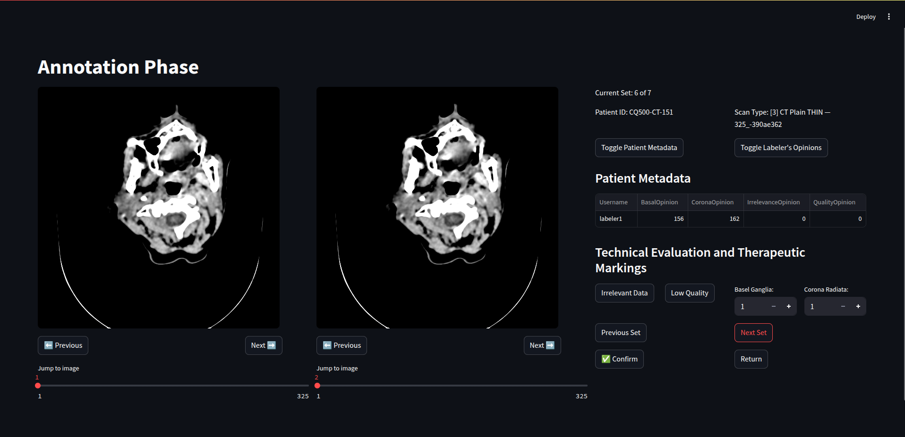

## MedFabric: Collaborative Intelligence on CT Ischemic Stroke Imaging

This is my project on my Machine Learning in Medicine course of ET4248E, Hanoi University of Science and Technology

The project is still in development, development branch is prioritized.

To run the project:

1. Download the dataset from Kaggle: <https://www.kaggle.com/datasets/crawford/qureai-headct>
the dataset folder
2. Use Weasis to convert your DICOM to png images
3. Clone the repository at

```bash
git clone https://github.com/Hung-nd233960/MachineLearningET4248E
```

4. make sure you have dependencies in the requirements.txt file. You can install them by

```bash
pip install -r requirements.txt
```

5. Run the scripts in EDA folder to preprocess data and make metadata files
6. Run the main file, which is

```bash
streamlit run main.py
```

### Images of the project

#### Dashboard



#### Annotation


