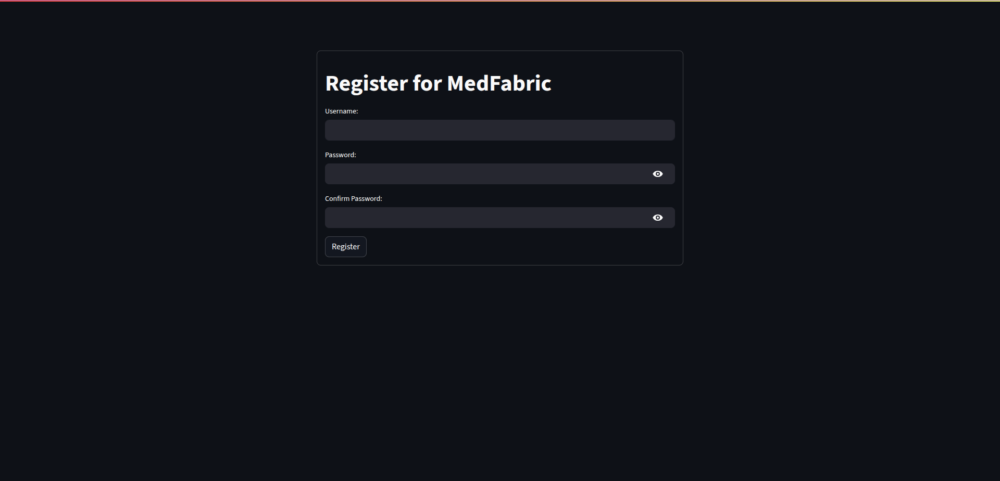
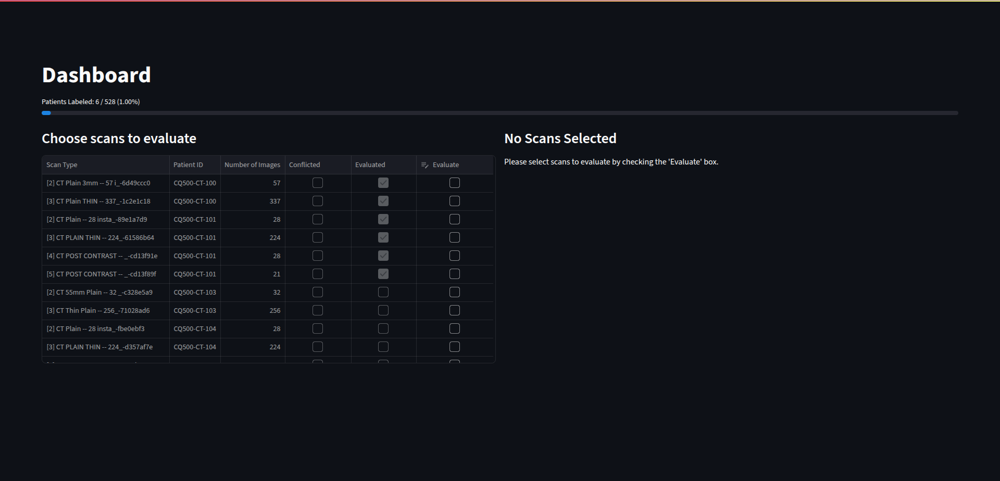
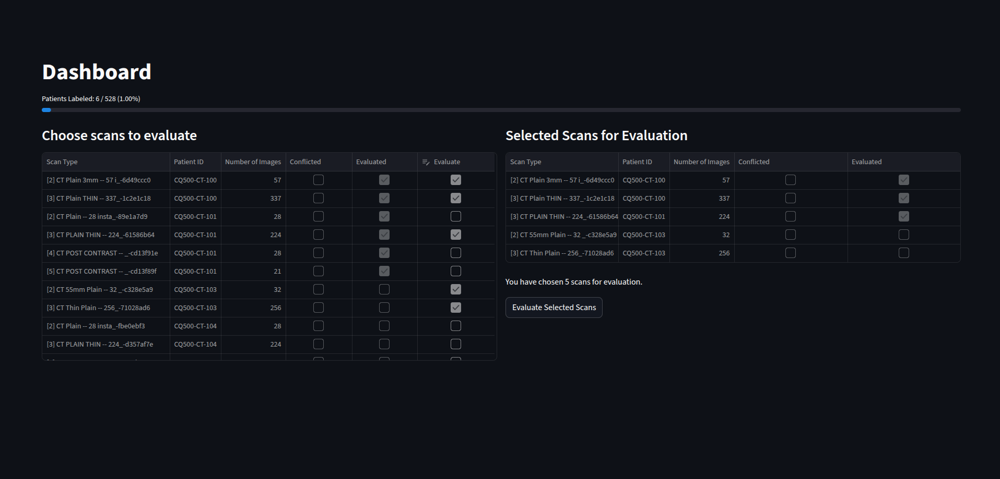
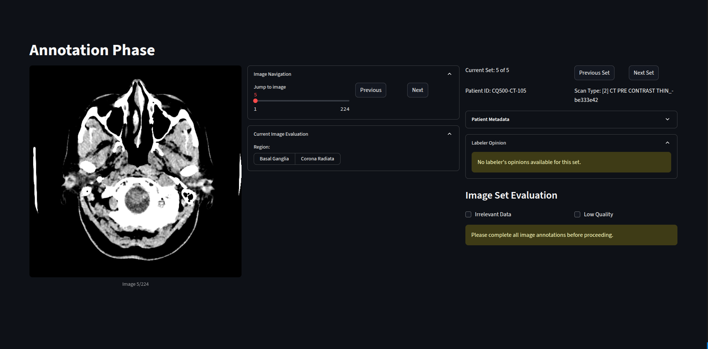
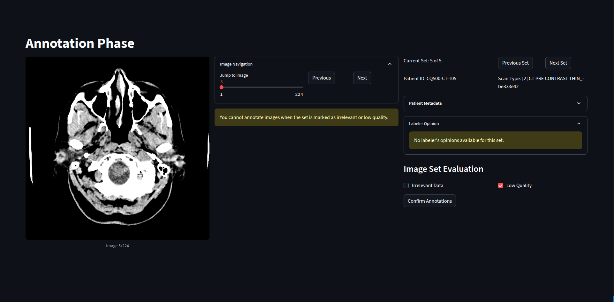
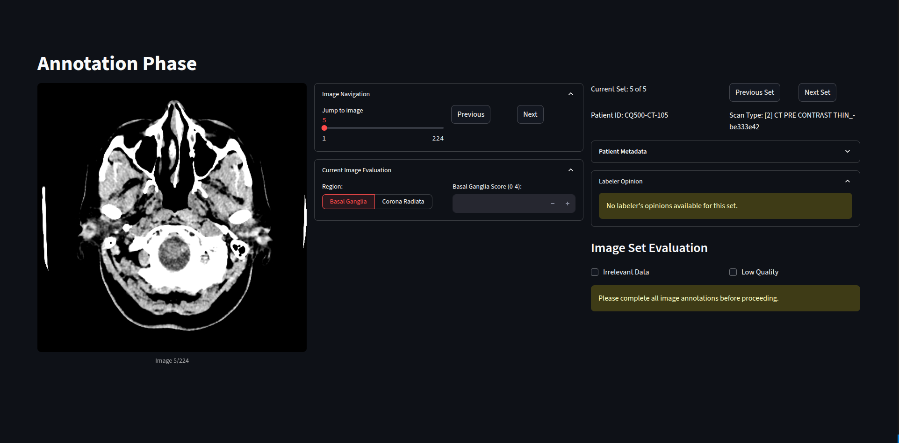
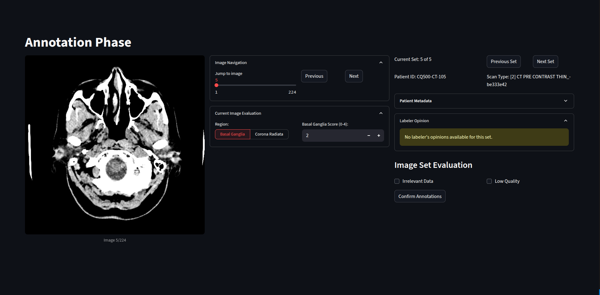

# Hướng Dẫn sử dụng phần mềm MedFabric

MedFabric là phần mềm sử dụng cho ghi nhãn từ ảnh CT của bệnh nhân, từ đó hỗ trợ chẩn đoán đột quỵ thiếu máu qua điểm ASPECTS.

Hiện tại, trọng tâm của MedFabric tập trung vào xác định các lát cắt:
- Vùng đồi thị - hạch nền (Basal Ganglia)
- Lát cắt trên hạch nền (Corona Radiata)

Hiện tại, MedFabric hỗ trợ nhập những nhãn sau:

- Các nhãn về chất lượng bộ ảnh: 
    - **Irrelevant**: Ảnh không liên quan đến yêu cầu xác định
    - **Low Quality**: Ảnh có chất lượng kém hoặc không thể nhìn được

- Các nhãn cho từng bức ảnh:
    - None: Ảnh không có giá trị trong chấm điểm ASPECTS
    - **BasalGanglia**: Ảnh của vùng Đồi thị - Hạch nền
    - **CoronaRadiata**: Lát cắt trên hạch nền

- Chấm điểm: Mỗi ảnh sau khi đã có nhãn vùng sẽ được chấm điểm ASPECTS tương ứng:
    - Các bức ảnh BasalGanglia sẽ được chấm điểm từ 0-4
    - Các bức ảnh CoronaRadiata sẽ được chấm điểm từ 0-6

Các nhãn tự động gán bởi cơ sở dữ liệu: 

- Nhãn xung đột: 1 bộ ảnh được đánh dấu là Xung đột (Conflict) khi **không** có quá bán các nhãn được nhập cho bộ ảnh đó có nội dung giống nhau.

## Hướng dẫn bằng hình ảnh:

### Bước 1. Đăng nhập

- Vui lòng nhập tên đăng nhập (Username) và mật khẩu (Password):

- Nếu chưa có username và password, vui lòng đăng kí (Lưu ý, mật khẩu cần có 8 kí tự trở lên) và quay lại đăng nhập:

### Bước 2. Chọn bộ ảnh:

- Tại bảng chọn bộ ảnh (Dashboard), từ trên xuống dưới, từ trái sang phải có:
    - Thanh trạng thái về số bộ ảnh mà tài khoản đã ghi nhãn trước.
    - Bảng tất cả các bộ ảnh CT trong cơ sở dữ liệu, trong đó:
        - Scan Type: mã của bộ ảnh CT, bao gồm loại ảnh CT và mã định danh bộ ảnh
        - Patient ID: mã định danh của bệnh nhân của bộ ảnh
        - Number of images: Số lượng lát cắt trong bộ ảnh
        - Conflicted: Cho biết bộ ảnh có đang bị xung đột (Conflict, xem phần trên, nhãn xung đột)
        - Evaluated: Cho biết bộ ảnh này đã được tài khoản hiện tại ghi nhãn chưa
        - Evaluate: chọn ảnh để ghi nhãn tại phiên này. Vui lòng chọn đúng ô vào đúng bức ảnh để chọn bộ ảnh.

Giao diện trước khi chọn

Giao diện sau khi chọn

- Các tùy chỉnh khác:
    - Sắp xếp (Sorting): Bằng cách nhấp vào tiêu đề từng cột, có thể sắp xếp bảng theo thứ tự tăng/giảm dần: Đưa các ảnh đã ghi nhãn lên trước hoặc ra sau; Số lượng lát cắt lớn đến nhỏ,...

- Sau khi chọn những bộ ảnh sẽ được ghi nhãn ở phiên này, chọn Evaluate Selected Scans

### Bước 3: ghi nhãn bộ ảnh

- Bảng điều khiển được chia làm ba phần: Xem ảnh, điều khiển và ghi nhãn ảnh và điều khiển bộ ảnh.

- Phần điều khiển ảnh (Image Navigation) gồm hai phần: Chọn ảnh và đánh nhãn ảnh.
    - Phần điều khiển ảnh có 1 thanh chọn, có thể kéo giữ hoặc nhấn chọn ảnh. Previous: Ảnh trước, Next: Ảnh sau
    - Mỗi ảnh có phần đánh giá riêng (Current Image Evaluation):
        - Region: Phân loại khu vực ảnh, mặc định là None (cả hai ô đều không được lựa chọn)
        - Nếu được chọn loại ảnh (Basal Ganglia hoặc Corona Radiata), sẽ hiên ra ô chấm điểm tương ứng: Basal Ganglia từ 0-4, Corona Radiata từ 0-6

- Phần điều khiển bộ ảnh gồm bốn phần: Thông tin bộ ảnh, thông tin bệnh nhân, ý kiến các nhãn sẵn có và đánh giá bộ ảnh:
    - Thông tin bộ ảnh bao gồm: 
        - Số thứ tự bộ ảnh của phiên này **Current Set**
        - Định danh bệnh nhân: **Patient ID**
        - Định danh và loại bộ ảnh: **Scan Type**
    - Nút chọn bộ ảnh: bộ ảnh trước: **Previous Set**, bộ ảnh tiếp: **Next Set**
    - Thông tin bệnh nhân **Patient Metadata** là thông tin bệnh lý được cho trước của bệnh nhân
    - Ý kiến của các tài khoản khác cho cùng một bộ ảnh **Labeler Opinion**
    - Đánh giá ảnh **Image Set Evaluation** có hai ô: Bộ ảnh không liên quan **Irrelevant Data** và chất lượng thấp **Low Quality** 

- Các quy tắc khi ghi nhãn:
    - Một bộ ảnh được coi là Đánh dấu xong khi:
        - Trong bộ ảnh có **ít nhất** 1 bức ảnh đánh dấu là BasalGanglia và 1 bức ảnh đánh dấu là CoronaRadiata và **tất cả** các bức ảnh đó đều được đánh dấu điểm
        - Hoặc bộ ảnh được đánh nhãn **Irrelevant** hoặc **Low Quality**
    - Hiện tại, ở mỗi phiên nhập, cần nhập tất cả các bộ ảnh đã chọn (Khi đó hiện lên nút **Confirm Annotations**) để  lưu dữ liệu về cơ sở dữ liệu.

- Hình ảnh:

hình ảnh ban đầu, bộ ảnh chưa được ghi nhãn

nếu bộ ảnh được đánh giá Irrelevant, không thể chấm vùng và điểm cho các ảnh thuộc bộ đó

sau khi chọn vùng, sẽ hiện ra ô nhập điểm, vui lòng nhập điểm tương ứng

### Các tính năng đang phát triển:

Latest Update: v1.6.0
- Tính năng lưu nháp, lưu những bộ ảnh đã đánh dấu trong phiên khi các bộ khác chưa được ghi nhãn.
- Nhập điểm tương ứng từng vùng: C, L, IC, I, M1-M6
- Xem ảnh ở nhiều window CT khác nhau.